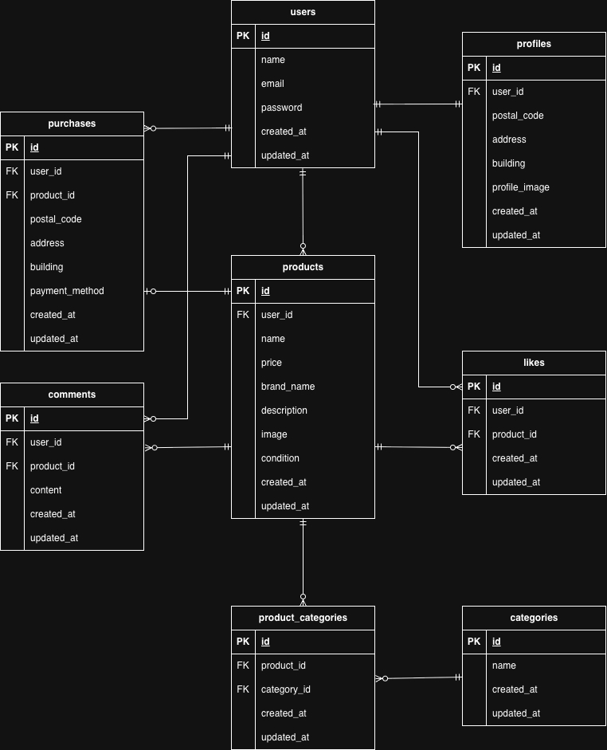

# Coachtechフリマ

## 環境構築

Dockerビルド
1. git clone
git@github.com:Estra-Coachtech/laravel-docker-template.git
2. リポジトリ名を変更
mv laravel-docker-template trial_project
3. リモートURLを変更
git remote set-url origin git@github.com:kinoppe/trial_project.git
4. Dockerコンテナを起動
docker-compose up -d --build

## Laravel 環境構築

1. docker-compose exec php bash
2. composer install
3. cp .env.example .env , 環境変数を適宜変更
DB_HOST=mysql
DB_DATABASE=laravel_db
DB_USERNAME=laravel_user
DB_PASSWORD=laravel_pass
4. php artisan key:generate
5. php artisan migrate
6. php artisan db:seed

## 使用技術

・PHP 8.1.34
・Laravel 8.83.29
・MySQL 8.0.36
・nginx 1.21.1

## ER図

## URL

開発環境
・商品一覧画面：http://localhost/
・会員登録画面：http://localhost/register
・ログイン画面：http://localhost/login
・商品詳細画面：http://localhost/item/{item_id}
・商品購入画面：http://localhost/purchase/{item_id}
・住所変更画面：http://localhost/purchase/address/{item_id}
・商品出品画面：http://localhost/sell
・プロフィール画面：http://localhost/mypage
・phpMyAdmin：http://localhost:8080/
